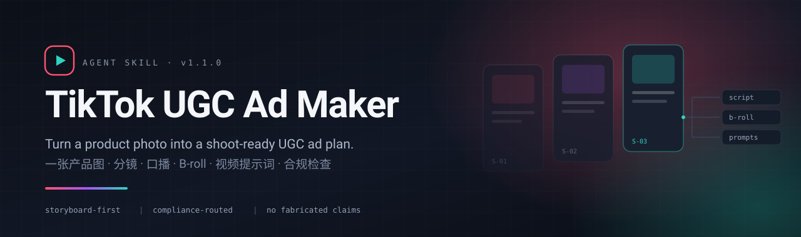
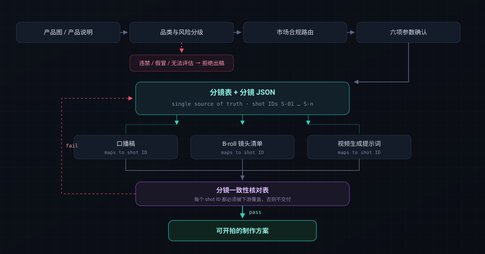
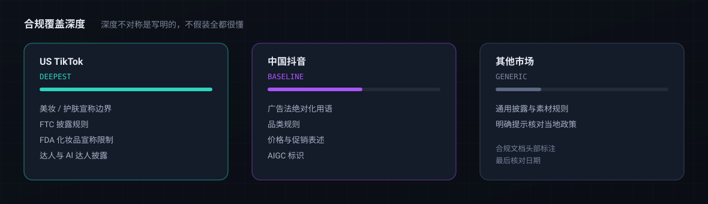

<div align="center">




[](tiktok-ugc-ad-maker/SKILL.md) [](https://claude.com/claude-code) [](https://openai.com/codex) [](https://github.com/ROTl24/tiktok-ai-skills/stargazers) [](#contributing)

[Quick Start](#quick-start) · [How It Works](#how-it-works) · [Compliance](#compliance-routing) · [Guardrails](#guardrails) · [中文说明](#中文说明)

</div>

---

## Why this exists

Most AI ad tools write copy. They do not know that a US skincare claim needs substantiation, that 绝对化用语 is illegal in Chinese advertising, that an AI-generated creator must not deliver first-person usage testimony, or that a storyboard shot and its voiceover line have to come from the same source of truth or the shoot falls apart.

`tiktok-ugc-ad-maker` is an Agent Skill that treats an ad plan as a **production document with a quality gate**, not a text generation. Every downstream asset — spoken script, B-roll list, video-generation prompt — is derived from one storyboard JSON, and the plan does not ship until a consistency checklist passes.

## What you get

A single run produces a 14-section production package:

| # | Section | What it is |
|---|---|---|
| 0 | 小白解释 | Only the terms this task needs, with why each matters for conversion |
| 1 | 制作参数确认 | Country, platform, organic vs paid, TikTok Shop card, language, voice format, duration, aspect ratio |
| 2 | 默认假设 | Every default chosen for you, stated openly and editable |
| 3 | 产品理解 | Features translated into physical / emotional / routine / proof hooks |
| 4 | 广告结构 | Timeline with 时间 · 内容 · 目的, hook inside the first 2s |
| 5 | 合规提示 | Disclosure, AIGC labelling, music rights, claim boundaries |
| 6 | 达人设定 | Fixed creator reference or designed virtual creator |
| 7 | Hook 库 | Exactly 10 hooks, A/B ready |
| 8 | 分镜表 + JSON | The single source of truth for everything downstream |
| 9-11 | 口播 / B-roll / 视频提示词 | Each block maps back to a storyboard shot ID |
| 12 | 分镜一致性核对表 | Must pass before delivery |
| 13 | 发布前检查 + 复盘 | Pre-flight checklist and post-launch iteration |

## Quick Start

Load the repository in any agent runtime that supports local skills (Claude Code, Codex, or your own harness):

```bash
git clone https://github.com/ROTl24/tiktok-ai-skills.git
```

Point your agent at `tiktok-ugc-ad-maker/`, then upload a product image and ask:

```
用 tiktok-ugc-ad-maker 给这个产品做一版美国 TikTok 15 秒真人口播广告方案
```

The skill confirms six parameters before writing anything:

| Parameter | Options |
|---|---|
| 投放国家 / 地区 | US TikTok, 中国抖音, other markets |
| 发布平台与投放方式 | 自然种草 / 付费投放, TikTok Shop 挂车 是/否 |
| 口播语言 | any |
| 声音形式 | 真人口播 / 旁白 |
| 达人 | uploaded reference (`@Image1`) or designed virtual creator |
| 视频时长 | 15s / 30s / 45s |

Say "你来决定" and it states its assumptions explicitly instead of hiding them.

## How It Works



The storyboard is not a deliverable among others — it is the **origin**. Section 12 fails the run if any shot ID is missing downstream, which is what stops the classic failure mode where the voiceover describes a shot the storyboard never planned.

## Compliance Routing



Coverage depth is **deliberately asymmetric and stated as such** — an honest compliance surface beats a uniform-looking one:

| Market | Depth | Covers |
|---|---|---|
| 🇺🇸 US TikTok | Deepest | Beauty/skincare claims, FTC disclosure, FDA cosmetic claim boundaries, influencer rules, AI-creator disclosure |
| 🇨🇳 中国抖音 | Baseline | 广告法绝对化用语, 品类规则, 价格促销, AIGC 标识 |
| 🌍 Other markets | Generic | General rules, with an explicit prompt to verify local platform policy |

Compliance references carry a **last-verified date** in their header. If the date is stale, or the category is restricted, the skill tells you to check current official policy before drafting direct-response copy.

## Guardrails

These are the rules the skill will not negotiate on:

- **Refuses to advertise** products that appear prohibited, counterfeit, unsafe, or too regulated to assess — and explains the blocker instead of producing a softened ad.
- **No fabricated testimony from virtual creators.** An AI-designed creator never says "I've been using this for months." It uses observable demonstration and in-frame reaction, and the AIGC label note is mandatory.
- **No invented substance.** Ingredients, certifications, test results, and prices are never generated.
- **No placeholder output.** "Show product", "highlight benefits", "add CTA" fail the quality gate — every section must carry product-specific detail drawn from the actual image.
- **Reference discipline.** `@Image1` creator, `@Image2` scene/style, `@Image3` product; each shot declares only the references it actually needs.

## Modes

| Mode | Use when |
|---|---|
| **Full package** | You want the complete 14-section document in one pass |
| **Staged delivery** | Confirm the storyboard first, then generate script / B-roll / prompts |
| **Incremental update** | Change one shot or hook; downstream modules update and the checklist re-runs |
| **Hook variant** | Swap only the opening for A/B testing, reuse everything else |

## Repository Structure

```text
tiktok-ai-skills/
├── tiktok-ugc-ad-maker/
│   ├── SKILL.md                 # workflow, quality gate, output contract
│   ├── agents/openai.yaml
│   └── references/
│       ├── general-tiktok-product-compliance.md
│       ├── us-tiktok-beauty-compliance.md
│       ├── cn-douyin-compliance.md
│       ├── output-quality-bar.md
│       ├── example-output.md      # gold-standard sample
│       └── iteration-playbook.md
└── docs/test-results/             # dated verification records
```

`references/example-output.md` is the quality baseline. Structural changes to `SKILL.md` require updating the sample and leaving a verification record in `docs/test-results/`.

## Design Principles

- Output serves a real shoot and a real ad buy, not a demo.
- Prefer specific product information over generic templates.
- Section numbering and output structure are defined **once** in `SKILL.md`; other documents reference by name to avoid sync drift.
- Compliance notes exist to keep an ad executable — they are not a substitute for legal review.

## Roadmap

- [ ] Deeper coverage for EU / UK / SEA markets
- [ ] Additional skills in the repository beyond `tiktok-ugc-ad-maker`
- [ ] Machine-readable compliance rule files
- [ ] More gold-standard samples across product categories

## Contributing

Issues and PRs welcome. When changing skill behaviour:

1. Update `SKILL.md` — it is the single definition of structure.
2. Regenerate `references/example-output.md` so the sample matches.
3. Add a dated verification record under `docs/test-results/`.

## License

Not yet specified. Until a license is added, default copyright applies and reuse rights are not granted.

---

## 中文说明

`tiktok-ugc-ad-maker` 是一个 Agent Skill，把产品图或产品说明转成**可直接开拍**的中文 UGC 广告方案。

它和普通 AI 文案工具的区别在于两点：

**一是合规前置。** 在写任何 hook 和卖点之前，先做品类与风险分级，再按目标市场路由到对应合规文档。美国 TikTok 覆盖最深（美妆专项、FTC 披露、FDA 化妆品宣称边界），中国抖音提供基础参考（绝对化用语、价格促销、AIGC 标识）。覆盖深度不对称这件事是明写出来的，不装作全都很懂。

**二是分镜作为唯一事实源。** 口播稿、B-roll 清单、视频生成提示词全部从同一份分镜 JSON 派生，每个时间块都要映射回分镜 shot ID；第 12 节的一致性核对表不通过就不交付。这挡掉了最常见的翻车方式——口播在描述一个分镜里根本没有的镜头。

护栏部分不可协商：违禁 / 假冒 / 无法评估的商品直接拒绝出稿；AI 虚拟达人不得编造使用史证言，只能用可观察的演示和镜头内即时反应，并强制 AIGC 标注；成分、认证、检测结果、价格一律不得虚构。

实际投放前仍需自行核对目标市场政策、落地页信息与广告主资质。
